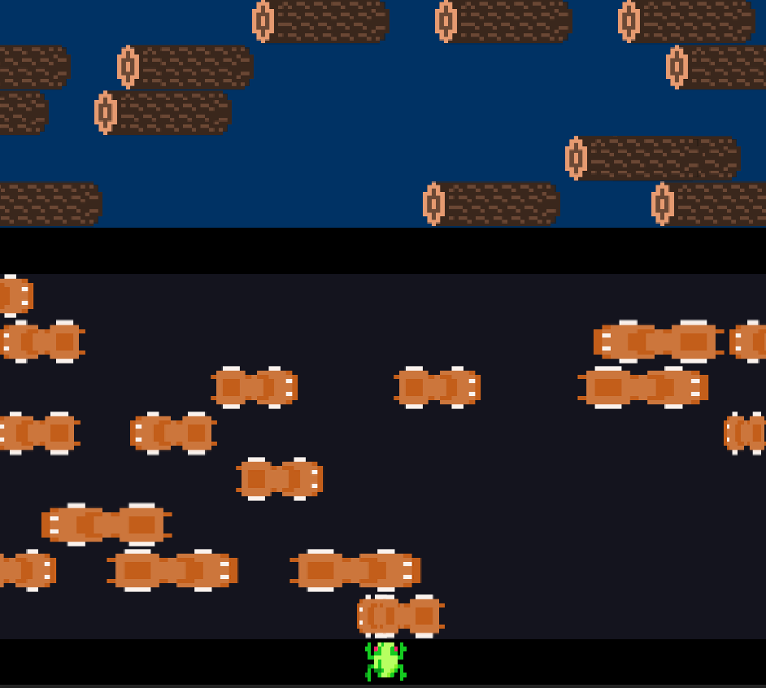

# Frogger
Frogger est un jeu vidéo d'arcade développé par Konami et sorti en 1981. 

Il s'agit ici d'une version du jeu développée en Java par Alexandre Kha, Delphine Fouquet et Sam Nzongani dans le cadre du cours "Java object-oriented programming" délivré à l'ENSTA Bretagne par Raúl Mazo Peña. 

Trois modes de jeu sont disponibles:

• Route

• Route + Rivière

• Route infinie

Il est possible de jouer seul(e) ou à 2.

## Installation
Voici les étapes à suivre pour jouer à Frogger avec [IntelliJ IDEA](https://www.jetbrains.com/fr-fr/idea/):

• Installer Processing: https://processing.org/download

• Télécharger le répertoire Frogger et l'ouvrir dans [IntelliJ IDEA](https://www.jetbrains.com/fr-fr/idea/)

• Aller dans File/Project Structure (Ctrl+Alt+Maj+S) et ajouter la librairie du répertoire core de Processing

• Toujours dans File/Project Structure sélectionner le module core et cliquer sur Apply

• Exécuter le fichier Main.java

## Visuel du jeu

## Remerciements
Nous tenons à remercier Raúl Mazo Peña et Hiba Hnaini pour leur précieux accompagnement au cours de ce projet.
